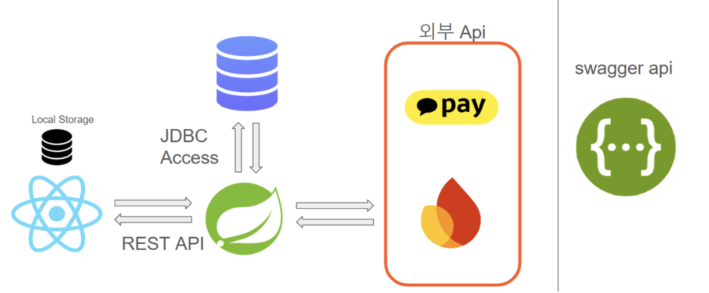
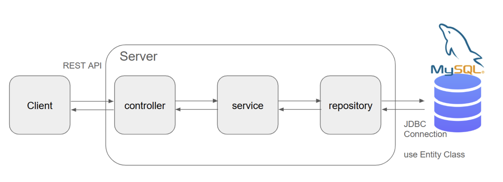
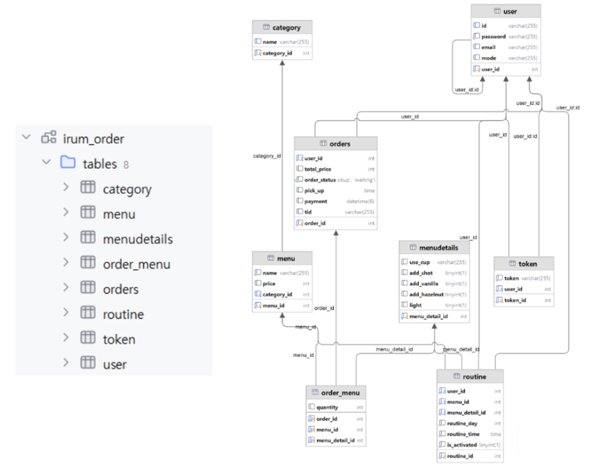

<div align="center">


# 🧋 이룸오더 (Irum Order)

서울시립대학교 컴퓨터과학부 2024년 소프트웨어공학 프로젝트<br/>
Software Development Life-Cycle 기반 객체지향 소프트웨어공학 방법론을 적용한 교내 카페 모바일 최적화 웹앱 주문 플랫폼

**진행 기간**: 2024.09. ~ 2024.12. (4개월)
</div>

---
## 📋 목차

1. [프로젝트 소개](#-project-overview)
2. [Tech Stack](#-tech-stack)
3. [주요 기능](#-주요-기능-key-features)
4. [나의 역할 및 구현 내용](#-나의-역할-및-구현-내용)
5. [흐름도](#-흐름도)
6. [Architecture](#-architecture)
7. [설치 및 활용](#️-설치-및-활용)
8. [레파지토리 구조](#-레파지토리-구조)
9. [MySQL DB 구조](#-mysql-db-구조)
10. [팀원 구성](#-팀원-구성)
11. [Further Reading](#-further-reading)

---

## 📖 Project Overview

이룸오더는 대학교 교내 카페에서 학생과 교직원이 **비대면으로 빠르고 편리하게 주문·결제**할 수 있도록 지원하는 모바일 최적화 웹앱 주문 플랫폼입니다.

수업 사이 10분 쉬는 시간, 점심시간처럼 붐비는 시간대에 대기 없이 원하는 시간에 픽업할 수 있도록 **픽업 예약 기능**과 **반복 주문 루틴 알림 기능**을 제공합니다.

| 항목 | 내용 |
|------|------|
| 팀명 | 이룸핑 |
| 팀원 | 박수빈, 이희진, 최진영, 양나슬, 김은지, 주영은 |
| 대상 매장 | 전농관 카페, 학생회관 카페 |
| 플랫폼 | Web (모바일 최적화) |

---

## 🛠 Tech Stack

**Frontend**


**Backend**


**API**


> 초기 React Native(Expo) 기반으로 개발을 시작했으나, 빌드 환경 안정성 및 웹 배포 효율을 고려해 React 웹앱으로 전환하였습니다.

---

## ✨ 주요 기능 (Key Features)

| 기능 | 설명 |
|------|------|
| 회원가입 / 로그인 / 로그아웃 | 아이디·이메일 인증 기반 가입 및 세션 관리 |
| 매장 선택 | 전농관·학생회관 카페 선택 후 메뉴 진입 |
| 메뉴 열람 | 카테고리별 메뉴 탐색, 옵션(온도·샷·컵 등) 선택 |
| 장바구니 | 상품 추가·삭제·수량 변경 |
| 픽업 시간 예약 | 10분 단위 픽업 시간 선택 (오픈~마감, 30분 전 예약 가능) |
| 결제 | 카카오페이 연동 선불 결제 |
| 주문 내역 확인 | 결제 후 주문 내역 날짜순 조회 |
| 주문 루틴 설정 | 요일·시간 기반 반복 주문 알림 등록/수정/삭제/ON-OFF |

> 직원·매장 관리자 기능은 기획 및 요구사항 명세(SRS)까지 완료하였으나 구현 범위에서 제외하였습니다.

---

## 🙋 나의 역할 및 구현 내용

**역할:** 기획 + 프론트엔드

### 기획
- 사용자 인터뷰 및 유사 앱(메머드커피, 메가커피) 분석을 통한 요구사항 도출
- 유스케이스 시나리오 작성 및 우선순위 결정
- SRS(소프트웨어 요구사항 명세서) 작성 주도 (V1.0 ~ V2.5)
- UML 다이어그램 및 UI 디자인 문서 작성·관리
- 코딩 컨벤션·리뷰 프로세스·레포지토리 운영 문서화로 팀 협업 표준 수립

### 프론트엔드 구현

**매장 선택 화면 (StoreSelection)**
- 주문 진입 전 필수 단계인 매장 선택 UI 설계 및 구현
- App·AppContent와 라우팅 연결, 툴바·스타일 포함 디자인 완성

**메뉴·카테고리 화면 (MenuGrid · MenuView · Category)**
- 카테고리 필터링 컴포넌트 구성 및 백엔드 API 연동
- 카테고리별 메뉴 탐색 및 화면 전환 흐름 구현

**옵션 선택 화면 (OptionView · Toolbar · OptionUnder)**
- OptionView·Toolbar·OptionUnder 컴포넌트 신규 설계
- 메뉴 탐색 → 옵션 선택 연결 UX 완성


### 트러블슈팅

**장바구니-결제 연동 최적화**
- `Issue` 장바구니 조작마다 API를 호출하면 백엔드 부하 증가 및 UX 지연 발생 가능
- `Solution` 장바구니를 사용자 키 기반 localStorage에 캐시하고, 결제 시점에만 주문·결제 API를 호출하도록 분리
- 장바구니 상태를 localStorage에 캐시하고 결제 시점에만 API를 호출하는 구조를 적용해 불필요한 서버 트래픽을 줄이고 사용자 응답성을 개선

**결제 userId 전달 정합성 개선**
- `Issue` 결제 흐름에서 userId/orderId 전달 누락·불일치로 승인 단계 실패 가능성 존재
- `Solution` 결제 준비 시 식별자 저장, 승인 시 복원·검증, 완료 후 정리까지 end-to-end 플로우 확립
- 결제 준비-승인-정리 단계의 식별자 전달 체계를 재설계하여 결제 안정성과 데이터 일관성을 확보

**카카오페이 연동 및 결제 완료 UX**
- `Issue` 실제 결제 수단 연계 및 결제 완료 후 상태 정리 필요
- `Solution` 카카오페이 준비/승인 API 연동 및 결제 완료 후 사용자 컨텍스트·스토리지 정리 로직 구현
- 카카오페이 연동을 구현하고 결제 완료 후 상태 정리 자동화를 적용해 주문 마감 품질을 향상

**옵션·루틴 기능 및 CSS 충돌 해결**
- `Issue` 옵션 선택 이상 동작, 루틴 저장 이슈, RoutineDetail.css 스타일 충돌 발생
- `Solution` 옵션뷰 생성·보정, 루틴 저장 로직 수정, CSS 충돌 수정으로 기능·표현 레이어 동시 안정화
- 루틴·옵션 도메인에서 기능 로직과 스타일 충돌을 동시 해결해 핵심 주문 시나리오의 완성도를 제고

**개발환경(Expo) 구조 재정비**
- `Issue` my-app·newapp·.expo 혼재로 개발환경 일관성 저하 및 협업 비용 증가
- `Solution` 불필요 구조 정리 및 단일 React 웹앱 기준으로 수렴, Expo → React 전환
- 혼재된 Expo 프로젝트 구조를 정리해 팀 개발환경 일관성과 온보딩 효율을 개선

> 프로젝트 협업 중 일부 작업에서 코드를 작성한 사람과 커밋을 올린 사람이 다를 수 있습니다. 환경 설정 및 장비 공유로 발생하였으며, 커밋 메시지에 실제 작성자의 이름이 명시되어 있습니다.


---

## 🔄 흐름도

### User Flow
```
로그인 → 매장 선택 → 메뉴 열람 → 옵션 선택 → 장바구니 → 픽업 시간 예약 → 결제 → 주문 내역 확인
```

### Data Flow
```
Frontend (React) ↔ REST API ↔ Backend (Spring) ↔ MySQL DB
                                      ↕
                               카카오페이 API / Firebase
```

---

## 🏗 Architecture

### 시스템 통합 구조


### Frontend — Feature-based Directory Structure


- 사용자의 입력 데이터를 처리하고, REST API를 통해 Backend와 상호작용합니다.
- Local Storage를 통해 클라이언트 측 데이터를 관리합니다.
- Feature-based Directory Structure

### Backend — MVC 구조


- Spring Framework 기반으로 구현된 애플리케이션 서버
- REST API를 통해 Frontend와 통신하며, 데이터 요청 및 응답을 처리합니다.
- 외부 API와 통신, 데이터베이스와 통신합니다.
- MVC 구조
 

---

## ⚙️ 설치 및 활용

### FrontEnd
```bash
git clone https://github.com/ej9374/Software-Engineering
cd Software-Engineering/IrumOrder_FrontEnd/irumorder_fe 
npm install
npm install react-router-dom
npm install firebase
npm start
```

### BackEnd

1. IntelliJ IDE 설치 및 JDK 17 설정
3. [카카오페이 개발자센터](https://developers.kakaopay.com/) 접속 후 비밀키 발급, `IrumOrder_BackEnd/src/main/resources/application.properties` 의 kakao.pay.secret-key에 발급받은 Secret key(dev) 작성
4. Gradle 빌드
    - `build.gradle` 실행:
      ```bash
      ./gradlew build
      ```
5. Spring Boot 애플리케이션 실행
    - `IrumOrderApplication` 실행:
      ```bash
      ./gradlew bootRun
      ```


### Database

1. MySQL Workbench 설치
2. `IrumOrder_DB` 폴더의 SQL 스크립트 실행하여 DB 초기화
3. `application.properties` 수정
    - `spring.datasource.username`: MySQL 사용자 이름
    - `spring.datasource.password`: MySQL 비밀번호
    - `spring.datasource.url`: MySQL 데이터베이스 URL
4. IntelliJ에서 MySQL 데이터베이스 연결 설정

### 알림 기능 사용 시

1.`/IrumOrder_Backend/src/main/resources/firebase/serviceAccount.json` 파일을 만든 후, 아래와 같은 형식으로 json 파일 저장

```json
    {

       "type": "service_account",
    
       "project_id": "irumorder",
    
       "private_key_id": ,
    
       "private_key": ,
    
       "client_email": ,
    
       "client_id": ,
    
       "auth_uri": ,
    
       "token_uri": ,
    
       "auth_provider_x509_cert_url": ,
    
       "client_x509_cert_url": ,
    
       "universe_domain": "googleapis.com"

   }
```

2. chrome에서 알림 기능을 킨 후 실행
3. 개발자모드의 콘솔창에서 "FCM Token: " 뒤의 전체 string을 복사해서 TokenEntity 데이터베이스에 저장(혹은 swagger.io에서 FcmController를 이용하여 데이터베이스에 저장)


---

##  🗂 레파지토리 구조

### Frontend (`IrumOrder_FrontEnd`)
```
irumorder_fe/src
├── features
│   ├── cart          # 장바구니
│   ├── check         # 주문 확인
│   ├── menu          # 메뉴·카테고리
│   ├── option        # 옵션 선택
│   ├── payment       # 결제·픽업예약
│   ├── store         # 매장 선택
│   ├── routine       # 주문 루틴
│   └── user          # 로그인·회원가입
├── firebase          # Firebase 설정
├── shared
│   ├── context       # 전역 상태 관리
│   └── ui            # 공통 UI (Toolbar 등)
├── App.js
├── index.js
└── setupProxy.js
```

### Backend (`IrumOrder_BackEnd`)
```
IrumOrder/src/main/java
└── Irumping/IrumOrder
    ├── config        # 앱 설정 (Web, Security, Firebase)
    ├── controller    # API 컨트롤러
    ├── dto           # 데이터 전송 객체
    ├── entity        # DB 엔티티
    ├── event         # 비동기 이벤트
    ├── exception     # 예외 처리
    ├── listener      # 이벤트 리스너
    ├── repository    # DB 접근
    ├── scheduler     # 루틴 알림 스케줄러
    ├── service       # 비즈니스 로직
    └── validator     # 입력 검증
```

---

## 🗄 MySQL DB 구조



---

## 👥 팀원 구성

| 이름 | GitHub | 역할 |
|------|--------|------|
| 박수빈 | [@aon0303](https://github.com/aon0303) | 기획, 프론트엔드 |
| 이희진 | [@22huijin](https://github.com/22huijin) | 기획, 프론트엔드 |
| 최진영 | [@glebungle](https://github.com/glebungle) | 프론트엔드, 디자인 |
| 양나슬 | [@yns030506](https://github.com/yns030506) | 백엔드 |
| 김은지 | [@ej9374](https://github.com/ej9374) | 백엔드 |
| 주영은 | [@ye0314](https://github.com/ye0314) | 백엔드 |

---
## 📚 Further Reading

- [소프트웨어 요구사항 명세서 SRS v2.5](artifacts/srs-template-v2.5%20wirrten%20by%20이룸오더.docx)
- [Software Architecture UML](artifacts/이룸오더%20high-level%20Architecture%20UML%20Diagram_v2.3.docx)
- [UI 디자인 문서](artifacts/이룸오더%20UI%20디자인%20문서%20v1.2.docx)
- [Coding Standard](artifacts/Coding%20Standard,%20Repository%20Management%20and%20Review%20Process.pdf)
- [API 문서](artifacts/api_docs.pdf)
- [Bug List](artifacts/Bug%20List.xlsx)
- [카카오페이 개발 문서](https://developers.kakaopay.com/)


